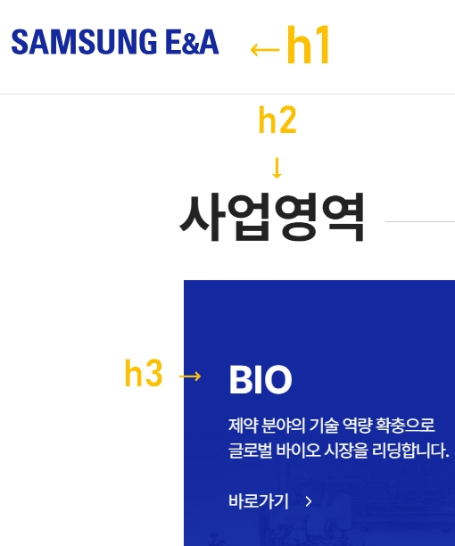

### 01. 제목태그

1. h1 - 상호, 로고명
2. h2 - 주메뉴
3. h3 - 보조메뉴
---

### 02. headline이 사용된 이미지
(* 삼성 엔지니어링 사이트 참고)




---

### 03. 코드확인

> headline.html

```html
<!DOCTYPE html>
<html lang="ko">
 <head>
  <title>headline</title>
  <meta charset="utf-8"/>
 <body>
	<h1>
		페이지 마다 가장 중요한 제목을 담당하는 태그 ( 삼성, LG, MBC, KBS)
	</h1>
	<h2>
		어떠한 영역의 제목을 담당하는 태그
		(삼성-반도체, LG-가전, MBC-9시 뉴스)
	</h2>
	<h3>
		h2 보다는 조금더 작은 세부 영역을
		담당하는 태그
		(MBC-9시 뉴스, 스포츠 소식, 정치 소식, 경제 소식..)
	</h3>
	<h4>
		일반 설명글의 제목이 되는 태그
		(스포츠 뉴스의 손흥민 해트트릭!, 국회의원 누구누구의 대표사퇴 소식..)
	</h4>
	<h5>
		headline 태그 h5, 네이버에서 작은 제목이나 본문을 다룰때 사용하는 태그그
	</h5>
	<h6>
		너무 작아서 파편화(글자가 깨져보이는) 현상이 발생할 수 있음
	</h6>
 </body>
</html>
```

---
