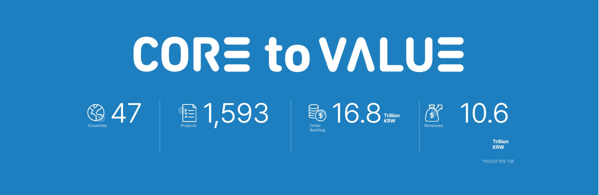

### 01. 웹을 구성하는 기본요소

화면을 다루는 웹에서 가장 기본적이면서 중요한
2가지 요소는 __"인라인요소"__ 와 __"블록요소"__ 이다.

---

### 02. 블록요소와 인라인요소 참고 이미지

> 블록요소 참고이미지



---


> 인라인요소 참고이미지


---

### 03. 코드확인

> inline-block-desc.html

```html

<!DOCTYPE html>
<html lang="ko">
 <head>
  <title>line-block</title>
  <meta charset="utf-8"/>
 <body>
	<h2>블록요소</h2>
	<p>
		블록요소란? 기본적으로 너비와 높이를 가지는 박스형태의 요소를 말한다.
	</p>
	<p>
		위의 참고 이미지를 보면 파란색 이미지가 끝에서 끝까지 영역을 채운것을
		확인할 수 있다. 
	</p>

	<h2>
		인라인요소
	</h2>
	<p>
		인라인요소란? 글씨처럼 옆으로 나열되는 형태를 인라인 요소라 말한다.
	</p>

	<span>
		위의 참고 이미지를 보면 글자 요소들이
		옆으로 나열된 것을 확인 할 수 있다.
	</span>

	<span>
		인라인 요소에는 br태그 처럼 스스로 닫는 태그도 있지만, span 태그 처럼 열고 닫고가 따로 있는 태그도 있기 때문에 사용시 주의 해야한다.
	</span>
	<hr/>
	<hr/>
	
	<h2>블록요소( div, p )</h2>
	<p>
		p태그는 문단을 나눌때 사용하는 태그로 주로 의미를 담는 태그로 사용된다.
	</p>
	<div>
		div 태그는 공간이나 영역을 분할하여 사용하는 태그로 사용된다.
	</div>
```

### 04. div와 p태그에 대하여 간단하게 이해하기

```
	<div>
		div 태그는 폴더 처럼 사용
		<div>
			폴더1
			<div>
				폴더2
			</div>
		</div>
		<div>
			div태그는 가장 큰 박스요소 (폴더처럼 사용한다고 생각한다.)
			p태그는 블록요소중에 가장작은 단위의 박스요소로 사용한다. (파일처럼 사용)
		</div>
		<div>
			<h2>div태그는 폴더</h2>
			<p>파일1</p>
			<p>파일2</p>
			<p>파일3</p>
			<p>파일4</p>
		</div>
	</div>
	<hr/>

	<h2>** div와 p제대로 사용하기 (잘못 된 형태)</h2>
	<p>
		<div>현재 상황은 파일안에 폴더 를 넣은 상황</div>
	</p>

	<p>
		<p>현재 상황은 파일안에 파일을 넣은 상황</p>
	</p>

	<p>
		validator를 통해 검색하면 에러나는 것을 확인 할 수 있다.
	</p>

```

### 05. 인라인 태그중 속성을 가지는 태그

```
	<span>
		span태그는 인라인 요소들 중에서 유일하게 아무 특징이 없는 태그
		특징이 없기 때문에 특징을 만들어서 사용이 가능하다.
	</span>
	<b>
		b태그는 담아준 글씨 요소를 굵게 표현할 때 사용한다.
		bold의 약자 표현
	</b>
	<strong>
		strong태그는 담아준 글씨 요소를 굵게 표현할 때 사용한다.
		스크린리더기가 읽어줄수 있는 태그!
	</strong>

	<i>
		i태그는 글자를 기울일때 사용한다.
		i태그는 italic의 약자 표현
	</i>

	<em>
		em태그는 글자를 기울일때 사용한다.
		strong과 마찬가지로 스크린리더기가 읽어줄수 있는 태그
	</em>

	<hr/>

	<span>
		hr은 구분선 (horizontal row의 약자)
	</span>
 </body>

```

---